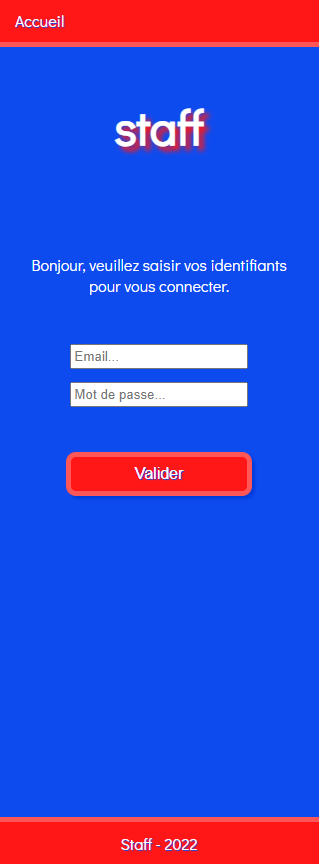
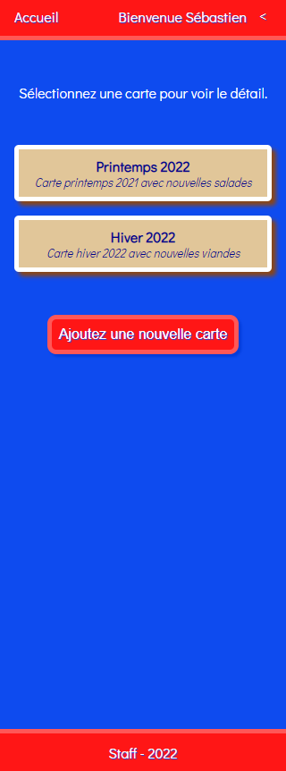

# Stan Front

  
  
  
  

  
## Table of contents

* What is Stan Front ?
* How does it work ?
* Stack

### What is Stan Front ?

Stan Front is a Case Study project for restaurant staff.  

You can consult all restaurant cards and create a new one.  

You can consult detail of each card and update card informations.  

Finally, you can delete a card.

### How does it work ?

Run the app on localhost:3000.

You can login using 'sebastien.parmentier@outlook.fr' or 'emmanuel@heystan.fr' with 'motdepasse' password for both account.

Once you are logged, you can browse the app.

Enjoy your Stan Front.

### Stack

Using Vite.js instead create-react-app.
